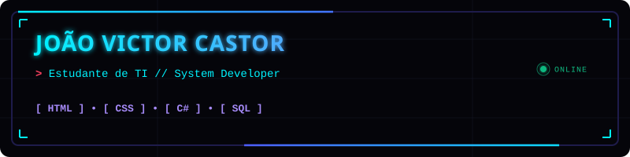

  

<h2 data-importer="text" align="center">About Me</h2>

###

-Colégio Cotemig @cotemig -Procurando Estágio -16 Anos

###

<h2 data-importer="text" align="center">Techs</h2>

###

  
  
  
  
  
  
  
  
  
  
  
  
  

###

<h2 data-importer="text" align="center">Stats</h2>

###

  
  

###

<h2 data-importer="text" align="center">Social Media</h2>

###

  
  
  
  

###
